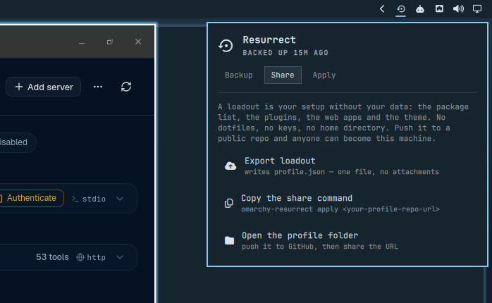
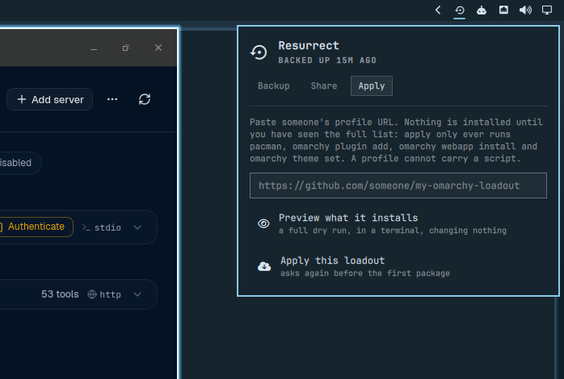
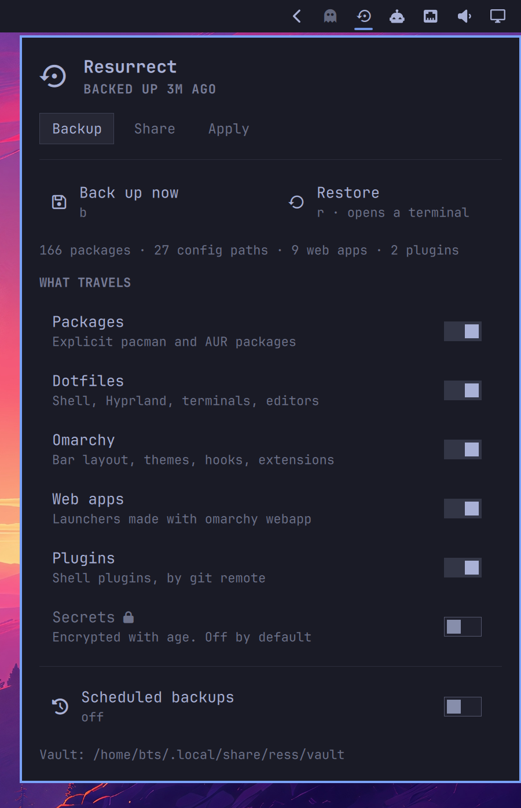

<h1 align="center">Resurrect</h1>

<p align="center"><strong>Bare metal to <em>your</em> machine, in one command.</strong></p>

<p align="center">
  <a href="docs/preview.jpg"></a>
</p>

<p align="center">
  <a href="docs/demo.gif"></a>
  <br><em>A real backup: 166 packages, 27 config paths, 9 web apps — three seconds.</em>
</p>

Omarchy installs in about a minute. Then you spend the evening putting your
things back: the packages, the dotfiles, the theme, the web apps, the plugins,
the twelve small decisions you have forgotten you ever made.

Resurrect is the other half of that minute.

```bash
ress backup                       # on the machine you like
ress restore --from <your-vault>  # on the machine that has nothing
```

## What it actually costs

Omarchy installs in under a minute because the ISO already carries almost
everything. That works in your favour on the way back: a restore does not
reinstall your machine, it fetches the difference.

Measured on the install in the screenshot — 166 explicit packages, 27 config
paths, 9 web apps:

| | |
|---|---|
| Backup | **3 seconds**, a 1.3 MB vault |
| Restore of everything except packages | **3 seconds** |
| Packages a fresh Omarchy actually needs | **8 of 166**, ≈ 145 MB |

Resurrect will tell you that number for your own machine, before you ever
rebuild anything:

```bash
$ ress diff --stock

Distance from a stock Omarchy install

  Omarchy ships                256 packages
  you have explicitly          166 packages
  a restore would fetch        8 packages

  cursor-cli fuse2 gtkmm3 hyprpolkitagent mesa-utils opencode
  open-vm-tools stably-orca-bin

  ≈ 145 MB to download.
```

Install in a minute, restore in about another. That is the whole idea.

---

## Install

```bash
omarchy plugin add https://github.com/tsouth89/omarchy-resurrect --enable
~/.config/omarchy/plugins/tsouth89.resurrect/bin/ress link   # puts `ress` on your PATH
ress init --remote https://github.com/you/my-omarchy-vault.git   # optional
ress backup
```

The vault is an ordinary git repo at `~/.local/share/ress/vault`. Push it
somewhere private if you want it off the machine; keep it local if you don't.
Nothing in Resurrect requires an account, a server, or a service.

### On a machine that has nothing

Two commands, from a TTY, before you have a desktop. No pipe into a shell —
Omarchy's own installer does the fetching, and it validates the manifest and
warns you before it clones anything:

```bash
omarchy plugin add https://github.com/tsouth89/omarchy-resurrect --yes
~/.config/omarchy/plugins/tsouth89.resurrect/bin/ress restore --from https://github.com/you/my-omarchy-vault
```

The second command clones your vault and replays it. The restore is
**resumable** — if the AUR times out or the power goes, run it again and it
picks up at the step it stopped on.

---

## What travels

| Category | What it captures | How it comes back |
|---|---|---|
| **Packages** | `pacman -Qqen` and `pacman -Qqem` | only the ones missing here get installed |
| **Dotfiles** | a curated list under `$HOME` — shells, Hyprland, terminals, editors | rsync, with every replaced file kept as `*.resurrect-bak` |
| **Omarchy** | `shell.json` bar layout, themes, hooks, extensions, branding, active theme | git themes re-cloned by URL, hand-made themes copied |
| **Web apps** | the `.desktop` launchers made by `omarchy webapp`, plus icons | rebuilt in place |
| **Plugins** | every shell plugin, by git remote and enabled state | `omarchy plugin add`, or a plain clone if the shell isn't up yet |
| **Secrets** | *off by default* — a list you write yourself | `age`-encrypted; see [Secrets](#secrets) |

It also records which **systemd user services** you have enabled and re-enables
them, rather than copying the `.wants/` symlink farms — those are state, and
copying them produces unit files that shadow the real ones.

## What does not travel

Deliberately, and this list is the point:

- **Credentials.** `hosts.yml`, `*.pem`, `*.key`, `.netrc`, `known_hosts` and
  friends are excluded from every capture, in every directory, always. The only
  path a secret can take is the opt-in encrypted one.
- **Anything over 20 MB**, caches, `node_modules`, `.venv`, `target`, build output.
- **Machine identity.** Disk UUIDs, hostname, network state, hardware config.
  A restore should make a machine *yours*, not make it pretend to be another one.
- **Your data.** Documents, photos, repos. Resurrect captures how a machine is
  set up, not what is on it. Use a real backup tool for real backups.

Resurrect tells you what it walked past: anything under `~/.config` that is not
on the list is written to `report/not-captured.txt` in the vault, so "I thought
that was backed up" is a thing you find out on the good machine, not the new one.

---

## Loadouts: your setup as a link

A **loadout** is your machine with your data removed — what is installed, not
what is in your files. It is a single `profile.json`: package names, plugin
repos, web app URLs, a theme name. That is the entire format.

```bash
ress share                                  # writes profile.json, prints your link
ress apply ress.sh/gh/someone/their-loadout # become someone else's setup
```

<p align="center">
  <a href="docs/share.png"></a>
  <a href="docs/apply.png"></a>
</p>

`ress apply` shows you **everything** it would install — every package, every
plugin, every web app — and installs nothing until you say yes:

```
Test Rig — by someone

This will install:

  2 packages from the Arch repos
      cowsay fortune-mod
  1 shell plugins
      acme.widget                      https://github.com/acme/widget
  1 web apps
      Fastmail                         https://app.fastmail.com/
  theme tokyo-night

This will not: remove anything, touch your dotfiles, run any script
  from the profile, or read anything outside the four actions above.

Apply this loadout? [y/N]
```

A loadout carries Resurrect itself, so whoever applies yours can immediately
share their own.

A ress.sh link is expanded to a GitHub URL **on your machine, before any
request is made** — so `ress apply` never actually talks to ress.sh, and a short
link works whether or not the shortener is reachable. Plain GitHub URLs work
everywhere a short link does.

`ress.sh/gh/<user>/<repo>` is a redirect to `github.com/<user>/<repo>` and
nothing else — no account, no upload, no copy of your profile. It is resolved
**on your machine, before any request is made**, and plain GitHub URLs work
everywhere a short link does. GitHub hosts the profile; ress.sh only shortens
the line so it fits in a message.

---

## The panel

<p align="center"><a href="docs/panel.png"></a></p>

A bar icon that dims as your backup gets stale, and a panel that is entirely
keyboard-driveable:

| Key | |
|---|---|
| `b` | back up now |
| `r` | restore (opens a terminal — see below) |
| `s` / `a` | jump to Share / Apply |
| `j` `k` / `↑` `↓` | move |
| `h` `l` / `←` `→` | switch tab |
| `Enter` / `Space` | activate |
| `Esc` | close |

Bind it if you like:

```lua
o.bind("SUPER + SHIFT + B", "Resurrect", hl.dsp.exec("omarchy-shell resurrect toggle"))
```

**Backup runs in the panel. Restore opens a terminal.** That is on purpose: a
restore installs packages and needs `sudo`, and a button that silently acquires
root is a button you should not trust. You watch it and you answer it.

---

## Commands

```
ress backup [-m MSG] [--push] [--secrets]   capture this machine
ress restore [--from URL] [--only LIST]     replay a vault, resumably
              [--skip LIST] [--dry-run] [--restart]
ress share [--name NAME]                    export a shareable loadout
ress apply <link> [--dry-run]               install someone else's loadout
ress status [--json]                        what is captured, and when
ress diff [--stock]                         what changed since the last backup,
                                            or how far this machine is from stock
ress init [--remote URL]                    create the vault
ress set KEY=VALUE                          change a setting
ress secrets <init|list|add|enable|disable>
ress doctor                                 check this machine is ready
ress link                                   put `ress` on your PATH
```

Every command is non-interactive with `--yes`, and speaks a line protocol with
`--porcelain` — which is exactly how the panel drives it.

## Dependencies

Everything Resurrect needs is already on a stock Omarchy install:

| | |
|---|---|
| Required | `git`, `rsync`, `jq`, `pacman` |
| Optional | `yay` (AUR packages on restore) · `age` (encrypted secrets) · `expac` (download sizes in `ress diff --stock`) · `wl-clipboard` (copy the share link) |

`ress restore` checks for the required ones before it starts and names the
missing package if any is absent. `ress doctor` reports the whole list.

## Uninstall

```bash
omarchy plugin remove tsouth89.resurrect     # removes the plugin and its bar entry
rm -f ~/.local/bin/ress                      # the PATH symlink, if you made one
```

That is the whole footprint in the shell. Your captured data is yours and is
left alone; delete it explicitly if you want it gone:

```bash
rm -rf ~/.local/share/ress    # the vault and any exported loadout
rm -rf ~/.config/ress         # settings, include/exclude lists
rm -rf ~/.local/state/ress    # the last-backup stamp and restore progress
```

Removing the plugin never touches anything it restored — your dotfiles, packages
and themes stay exactly as they are.

## Configuration

One file, `~/.config/ress/config`, read by both the CLI and the panel. There is
no second source of truth:

```ini
VAULT=/home/you/.local/share/ress/vault
REMOTE=https://github.com/you/my-omarchy-vault.git
AUTO_BACKUP=on
AUTO_INTERVAL_HOURS=24
AUTO_PUSH=1
INCLUDE_PACKAGES=1
INCLUDE_CONFIG=1
INCLUDE_OMARCHY=1
INCLUDE_WEBAPPS=1
INCLUDE_PLUGINS=1
INCLUDE_SECRETS=0
```

Add paths in `~/.config/ress/include`, exclude patterns in
`~/.config/ress/exclude`. Both are appended to the lists Resurrect ships in
`defaults/`.

Scheduled backups are event-driven, not polled: the timer is set to the
deadline, so an idle machine wakes it once a day rather than 1,440 times.

## Secrets

Off until you turn it on, and then still explicit:

```bash
sudo pacman -S age
ress secrets init      # writes a list for you to edit — nothing is assumed
ress secrets enable
ress backup            # asks for a passphrase; the vault only ever holds ciphertext
```

The passphrase is never stored, so an unattended scheduled backup skips the
secrets category and says so. Lose the passphrase and the blob is noise —
that is the trade, and it is stated up front rather than in a footnote.

---

## Security

Resurrect touches your package manager, so here is exactly how and why.

**Nothing happens at install time.** Adding the plugin clones files. There are
no install hooks, no post-install scripts, no `sudo`. The manifest declares
`bar-widget` and `service`; neither runs a package command on its own.

**`pacman` is only ever called two ways**, both after you have seen the list:

- `ress restore` — replays *your own* vault, and only installs what is missing.
- `ress apply` — installs from someone else's loadout, after a full preview and
  an explicit confirmation.

Neither ever removes a package. Restore's file writes keep every replaced file
as `*.resurrect-bak`.

**A loadout cannot carry a secret or a script.** The profile format is one JSON
file whose fields are names and URLs — package names, a theme name, git URLs,
web app URLs. There is no field that holds file contents and no field that holds
a command, so there is nowhere to put one. Web apps are rebuilt from a name, a
URL and an icon through `omarchy webapp install` rather than by copying a
`.desktop` file, because a `.desktop` file *is* an `Exec` line.

**Everything from a profile is validated before it reaches a command line.**
Package names, plugin ids, theme names and labels must match strict patterns;
URLs must be `https`. Entries that do not match are dropped, not quoted. In
testing, a profile containing `; rm -rf /`, `$(whoami)`, `../../evil`,
`file:///etc/passwd`, `Evil; touch /tmp/pwned` and an `http://` URL had all six
silently discarded and installed nothing.

**Apply only knows four verbs**: install a package, add a plugin, add a web app,
set a theme. There is no fifth, and no path from profile data to a shell.

## How this differs from what Omarchy already has

- **`omarchy snapshot`** is snapper on the local disk: excellent for undoing
  this morning, useless when the disk is gone or the machine is new. Resurrect
  is portable and machine-to-machine.
- **The core `omarchy-backup` PR** ([#6965](https://github.com/basecamp/omarchy/pull/6965))
  covers config, packages, themes and web apps from the CLI. Resurrect adds the
  installed **plugin list**, **AUR packages** handled separately, opt-in
  **encrypted secrets**, systemd enable-state, a resumable restore, a native
  Quickshell panel, and shareable loadouts. If that PR lands, use whichever you
  prefer — this one is a plugin, so it costs Omarchy nothing.

## Development

```bash
git clone https://github.com/tsouth89/omarchy-resurrect
cd omarchy-resurrect
omarchy plugin validate .
rsync -a --exclude '.git/' ./ ~/.config/omarchy/plugins/tsouth89.resurrect/
omarchy-restart-shell          # QML edits need a restart; hot reload can serve stale code
```

The CLI (`bin/ress`) is the whole engine and has no QML dependency — it runs
from a TTY on a machine with no desktop. `Panel.qml` and `Service.qml` are a
face on top of it, and every button is one subcommand with `--porcelain`.

## License

MIT — see [LICENSE](LICENSE).
